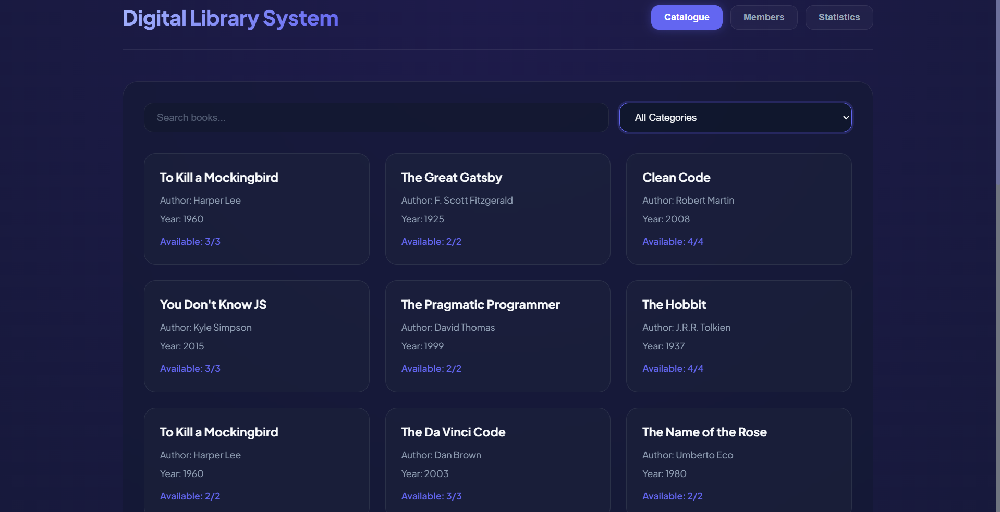
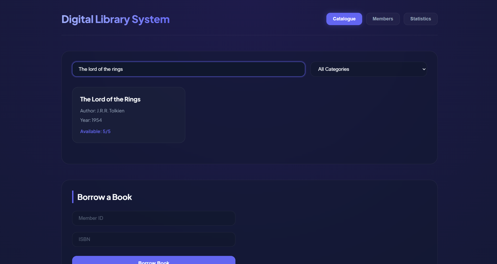
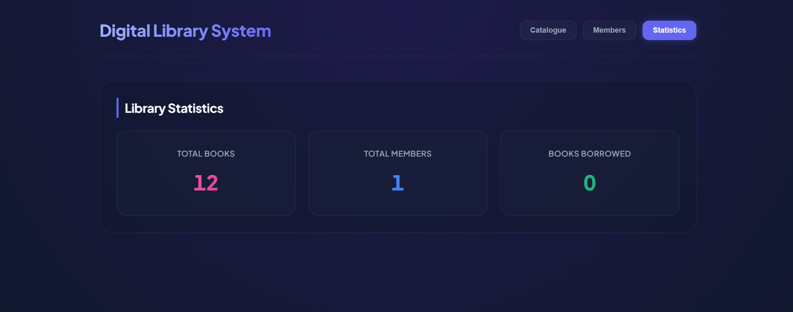
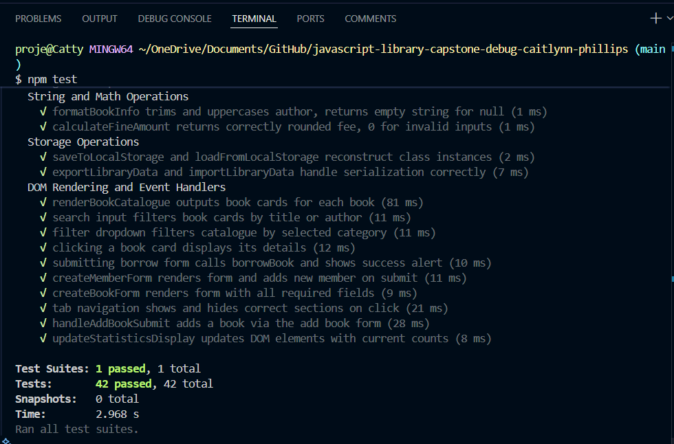
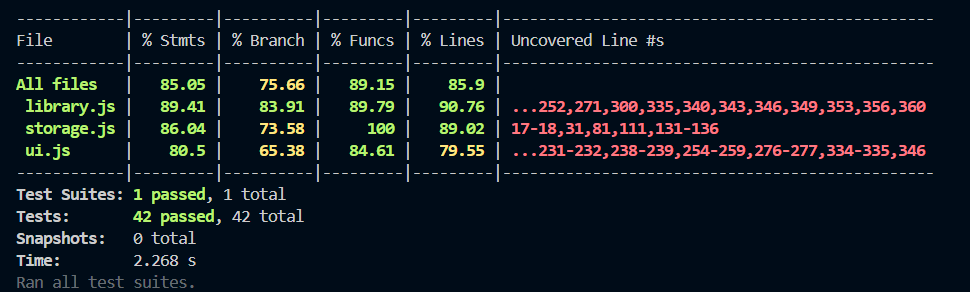

[](https://classroom.github.com/online_ide?assignment_repo_id=24150719&assignment_repo_type=AssignmentRepo)

# Digital Library Management System

A browser-based library application built with vanilla JavaScript (ES6+). Manages books, members, borrowing operations and statistics with full localStorage persistence.

## Installation and Setup

```bash
git clone <your-repo-url>
cd javascript-library-capstone-debug-caitlynn-phillips
npm install
```

Open `index.html` with Live Server in VS Code to run the app.

## Running Tests

```bash
npm test
npm test -- --coverage
```

## Critical Errors Found (24)

| # | File | Error | Severity |
|---|------|-------|----------|
| 1 | library.js | `books` undeclared global variable | Critical |
| 2 | library.js | `MAX_BOOKS_PER_MEMBER` undeclared global variable | Critical |
| 3 | library.js | `DigitalBook` missing `super()` call — crashes on instantiation | Critical |
| 4 | library.js | `Book` missing `availableCopies` and `totalCopies` properties | Critical |
| 5 | library.js | `Member.canBorrow()` uses `=` instead of `===` — always returns false | Critical |
| 6 | library.js | `findMemberById()` uses `=` instead of `===` — always matches first member | Critical |
| 7 | library.js | `processReturnQueue()` missing `index++` — infinite loop | Critical |
| 8 | library.js | `searchBooksByCategory()` missing base case — stack overflow | Critical |
| 9 | ui.js | `initializeUI()` called before DOM loads — all selectors return null | Critical |
| 10 | ui.js | `filterDropdown` selector missing `#` — element never found | Critical |
| 11 | ui.js | `handleBorrowSubmit()` missing `event.preventDefault()` — page reloads | Critical |
| 12 | ui.js | `saveToLocalStorage()` missing `JSON.stringify` — stores `[object Object]` | Critical |
| 13 | ui.js | `loadFromLocalStorage()` missing `JSON.parse` — assigns raw strings | Critical |
| 14 | ui.js | `handleFilterChange()` uses `=` instead of `===` — filter never works | Critical |
| 15 | library.js | `searchBooksByCategory()` uses `=` instead of `===` | Critical |
| 16 | library.js | All `var` declarations — wrong scoping throughout | Major |
| 17 | library.js | `Member` missing `joinDate` property | Major |
| 18 | library.js | `PremiumMember` missing `canBorrow()` override | Major |
| 19 | library.js | `getBooksByAuthor()` uses `==` instead of `===` | Major |
| 20 | library.js | `calculateFineAmount()` missing `toFixed(2)` | Major |
| 21 | ui.js | `handleSearch()` case-sensitive — misses valid results | Major |
| 22 | ui.js | `exportLibraryData()` returns raw object instead of JSON string | Major |
| 23 | library.test.js | No `beforeEach` setup — test data never initialized | Major |
| 24 | library.test.js | All `describe` blocks empty — no test implementations | Major |

## Fixes Implemented

**Variables and Operators:** Replaced all `var` with `let`/`const`, fixed all `=` to `===`, added `typeof` and null checks throughout.

**Classes:** Completed all four classes — added missing properties, fixed `super()` call in `DigitalBook`, added `canBorrow()` override in `PremiumMember`, added `joinDate`, `getMembershipDuration()` and `getMemberInfo()` to `Member`.

**Control Flow:** Fixed infinite loop in `processReturnQueue`, added base case to `searchBooksByCategory`, replaced `var` loops with `for...of` and array methods.

**Functions:** Replaced loops with `filter`, `reduce`, `find`, `map`. Added spread operator to `combineBookCollections`, rest parameters to `addMultipleBooks`, destructuring to `updateMemberInfo`.

**DOM:** Fixed `DOMContentLoaded` initialization, fixed selector errors, added `event.preventDefault()`, fixed `JSON.stringify`/`JSON.parse` in localStorage, added event delegation for book and member cards.

**Error Handling:** Added `try/catch` blocks to all error-prone functions, added input validation to all functions.

## Modern JavaScript Features Added

- ES6 classes with inheritance (`DigitalBook extends Book`, `PremiumMember extends Member`)
- Template literals replacing all string concatenation
- Destructuring in `updateMemberInfo`, `getMemberInfo`, `getStats`
- Spread operator in `combineBookCollections`, `setBooks`
- Rest parameters in `addMultipleBooks`
- `for...of` loops in `findOverdueBooks`, `processReturnQueue`, `addMultipleBooks`
- Array methods: `filter`, `map`, `reduce`, `find`, `some`
- `Map` data structure for O(1) ISBN lookups
- ES6 modules with `import`/`export` throughout

## Architecture

Three-module structure: `library.js` handles all core logic and data, `storage.js` handles JSON serialization and localStorage with class instance reconstruction, `ui.js` handles all DOM rendering and event handling.

## Screenshots

### Application Running


### Search Feature


### Statistics Display


### Tests Passing


### Coverage Report


## Reflection

The most complex bugs were the operator errors — using `=` instead of `===` in conditionals caused silent failures that were hard to trace. For example, `Member.canBorrow()` always returned `false` because the assignment `this.borrowedBooks.length = MAX_BOOKS_PER_MEMBER` always evaluated as truthy.

The infinite loop in `processReturnQueue` and missing base case in the recursive `searchBooksByCategory` were also critical — both would freeze or crash the browser immediately.

The debugging strategy was systematic: fix declarations first, then class inheritance, then operators, then control flow, then functions, then DOM. Committing each fix separately made it easy to isolate regressions. The biggest lesson was that silent failures from wrong operators are harder to debug than crashes.